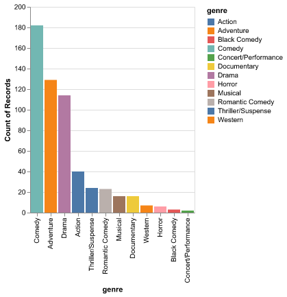
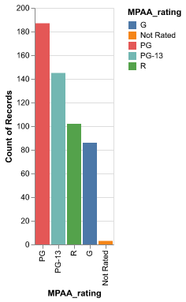
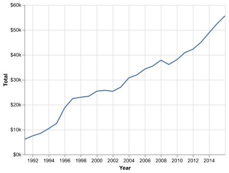
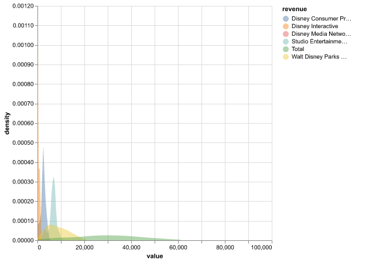
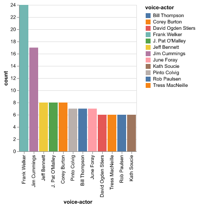
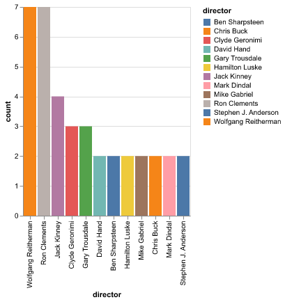

```{r setup, include=FALSE}
knitr::opts_chunk$set(echo = FALSE)
```

# Introduction

Walt Disney, fully Walt Elias Disney (December 5, 1901 - December 15
1966), was an American motion-picture and television producer, animator,
showman and entrepreneur who created the famous cartoon characters
Mickey Mouse and Donald Duck. He first opened Disney Brothers Studio
with his brother in their garage, then changed the name to Walt Disney
Studio and which finally became Walt Disney Productions. He also went on
to built Disneyland in California and Disney World in Florida. Animation
films have not ceased after his death and Disney went on to produce over
700 movies by 2016. In this project, I attempted to explore several
features of Disney movies released from 1937 - 2016.

# Data

The dataset was originally founded by Kelly Garrett on Kaggle
[@https://www.kaggle.com/datasets/maricinnamon/walt-disney-character-dataset]
and unzipped and uploaded to github by uomodellamansarda
[@uomodellamansarda]. There are 5 datasets (`disney_characters`,
`disney_movies_total_gross`, `disney_director`, `disney_voice_actors`,
and `disney_revenue_1991_2016`) which I cleaned and merged (with the
exception of `disney_revenue_1991_2016`) to create a holistic single
dataset.

# Exploratory Data Analysis

```{r genre chart, echo=FALSE, fig.cap="Figure 1", out.width="50%", out.height="80%"}
knitr::include_graphics("../data/figures/genre_chart.png")
```

From the graph above, we can see that sum of total gross earnings for
all adventure movies released by Disney from 1937 - 2016 is the highest,
followed by comedy movies. Gross refers to the total amount of revenue
generated by a movie or other entertainment product, typically from
ticket sales. The inflation adjusted gross is calculated by dividing the
total gross by the average ticket price of that release year to estimate
the number of tickets sold, which is then multiplied by the estimated
average ticket price for that year to give a rough idea of what every
movie made in the dollar value of that year.

```{r genre count, echo=FALSE, fig.cap="Figure 2", out.width="50%", out.height="60%"}

```

From the above graph, we can see that Disney released more comedy movies
than any other genres from 1937 - 2016, still, adventure movies
generated from gross earnings than comedy movies.

```{r rating count, echo=FALSE, fig.cap="Figure 3", out.width="50%", out.height="60%"}

```

From the above graph, we can see that most Disney movies released in the
aforementioned time frame have a PG rating, which makes sense since a
big portion of viewers are children under the age of 13.

```{r year chart, echo=FALSE, fig.cap="Figure 4", out.width="50%", out.height="60%"}
knitr::include_graphics("../data/figures/year_chart.png")

```

The line graph above shows the sum of gross and adjusted gross earnings
for all movies produced in the indicated year. We can see that there are
fluctuations through the years but the biggest jump happened from
2014-2016.

```{r revenue chart, echo=FALSE, fig.cap="Figure 5", out.width="50%", out.height="60%"}

```

```{r revenue density, echo=FALSE, fig.cap="Figure 6", out.width="50%", out.height="60%"}

```

Disney's total revenue generated from 1991 - 2016 is the sum of revenue
generated from Studio Entertainment, Disney Consumer Products, Disney
Interactive, Disney Media Network and Walt Disney Parks and Recreation.
We can see from figure 5 that the total revenue kept on increasing
progressively and figure 6 shows how total revenue is individually
distributed.

```{r voice actor count, echo=FALSE, fig.cap="Figure 7", out.width="50%", out.height="60%"}

```

```{r director count, echo=FALSE, fig.cap="Figure 8", out.width="50%", out.height="60%"}

```

```{r director genres, echo=FALSE, fig.cap="Figure 9", out.width="50%", out.height="80%"}
knitr::include_graphics("../data/figures/director_genres.png")
```

Figure 7 shows that Frank Walker was a voice actor for 24 characters in
Disney movies from 1937 - 2016, while figure 8 shows that directors
Wolfgang Reitheman and Ron Clements directed 7 movies, with the former
directing a collection of adventure, comedy and musical movies while the
latter directed mostly adventure movies and one comedy movie.
