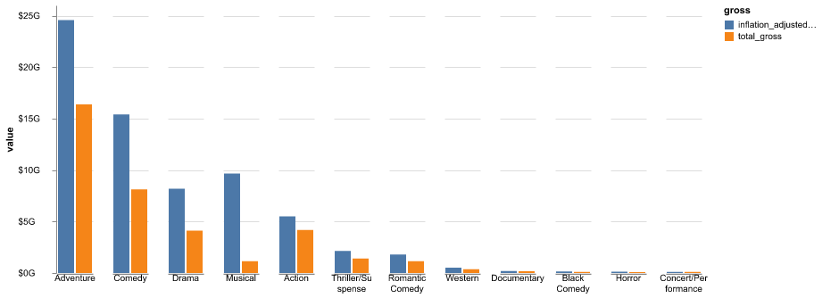
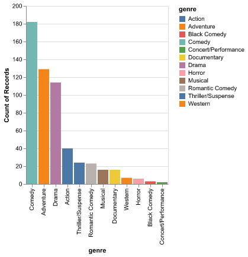
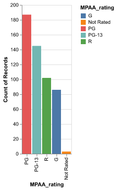
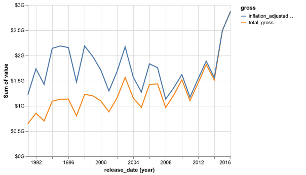
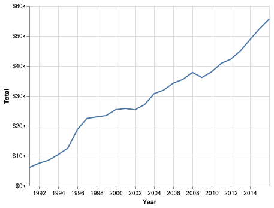
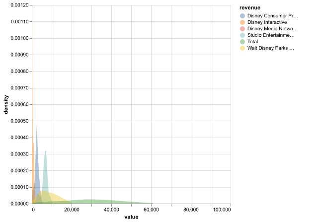
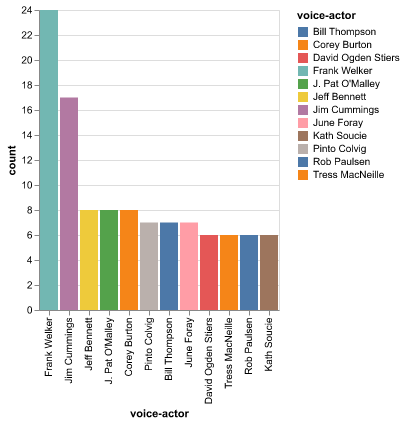
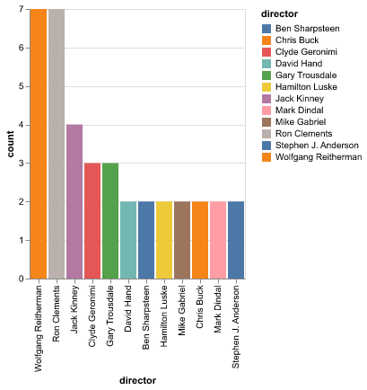
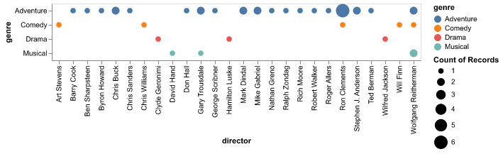

# Disney Movies Analyses

Sarah Abdelazim 2023-01-06

-   [Introduction](#introduction)
-   [Data](#data)
-   [Exploratory Data Analysis](#exploratory-data-analysis)

# Introduction {#introduction}

Walt Disney, fully Walt Elias Disney (December 5, 1901 - December 15 1966), was an American motion-picture and television producer, animator, showman and entrepreneur who created the famous cartoon characters Mickey Mouse and Donald Duck. He first opened Disney Brothers Studio with his brother in their garage, then changed the name to Walt Disney Studio and which finally became Walt Disney Productions. He also went on to built Disneyland in California and Disney World in Florida. Animation films have not ceased after his death and Disney went on to produce over 700 movies by 2016. In this project, I attempted to explore several features of Disney movies released from 1937 - 2016.

# Data {#data}

The dataset was originally founded by Kelly Garrett on Kaggle $$@https://www.kaggle.com/datasets/maricinnamon/walt-disney-character-dataset$$ and unzipped and uploaded to github by uomodellamansarda $$@uomodellamansarda$$. There are 5 datasets (`disney_characters`, `disney_movies_total_gross`, `disney_director`, `disney_voice_actors`, and `disney_revenue_1991_2016`) which I cleaned and merged (with the exception of `disney_revenue_1991_2016`) to create a holistic single dataset.

# Exploratory Data Analysis {#exploratory-data-analysis}

::: figure

Figure 1

:::

From the graph above, we can see that sum of total gross earnings for all adventure movies released by Disney from 1937 - 2016 is the highest, followed by comedy movies. Gross refers to the total amount of revenue generated by a movie or other entertainment product, typically from ticket sales. The inflation adjusted gross is calculated by dividing the total gross by the average ticket price of that release year to estimate the number of tickets sold, which is then multiplied by the estimated average ticket price for that year to give a rough idea of what every movie made in the dollar value of that year.

::: figure

Figure 2

:::

From the above graph, we can see that Disney released more comedy movies than any other genres from 1937 - 2016, still, adventure movies generated from gross earnings than comedy movies.

::: figure

Figure 3

:::

From the above graph, we can see that most Disney movies released in the aforementioned time frame have a PG rating, which makes sense since a big portion of viewers are children under the age of 13.

::: figure

Figure 4

:::

The line graph above shows the sum of gross and adjusted gross earnings for all movies produced in the indicated year. We can see that there are fluctuations through the years but the biggest jump happened from 2014-2016.

::: figure

Figure 5

:::

::: figure

Figure 6

:::

Disney's total revenue generated from 1991 - 2016 is the sum of revenue generated from Studio Entertainment, Disney Consumer Products, Disney Interactive, Disney Media Network and Walt Disney Parks and Recreation. We can see from figure 5 that the total revenue kept on increasing progressively and figure 6 shows how total revenue is individually distributed.

::: figure

Figure 7

:::

::: figure

Figure 8

:::

::: figure

Figure 9

:::

Figure 7 shows that Frank Walker was a voice actor for 24 characters in Disney movies from 1937 - 2016, while figure 8 shows that directors Wolfgang Reitheman and Ron Clements directed 7 movies, with the former directing a collection of adventure, comedy and musical movies while the latter directed mostly adventure movies and one comedy movie.
